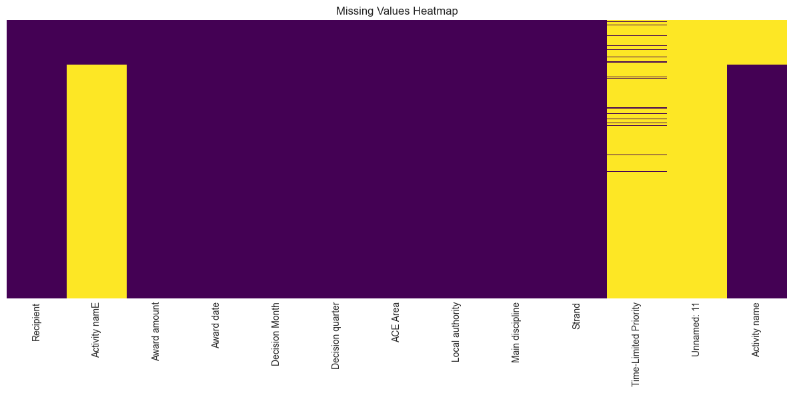
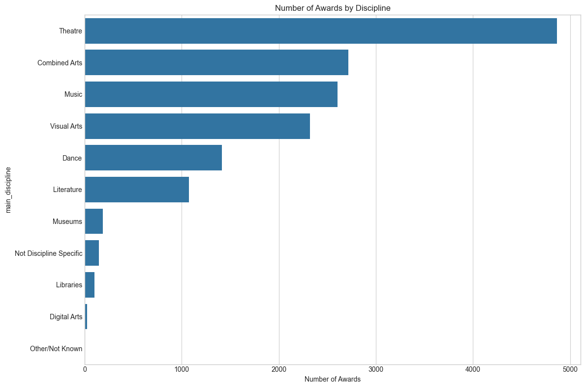
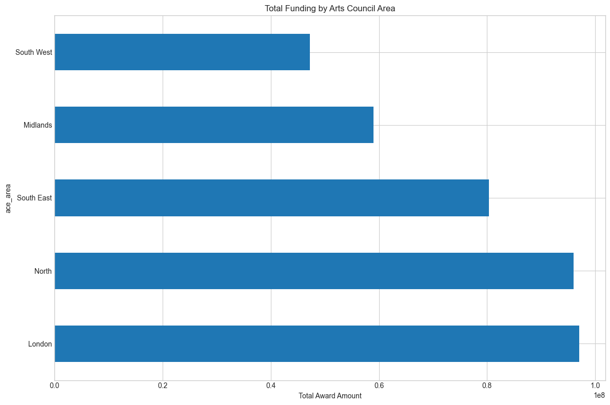
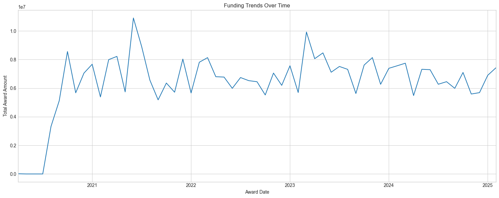
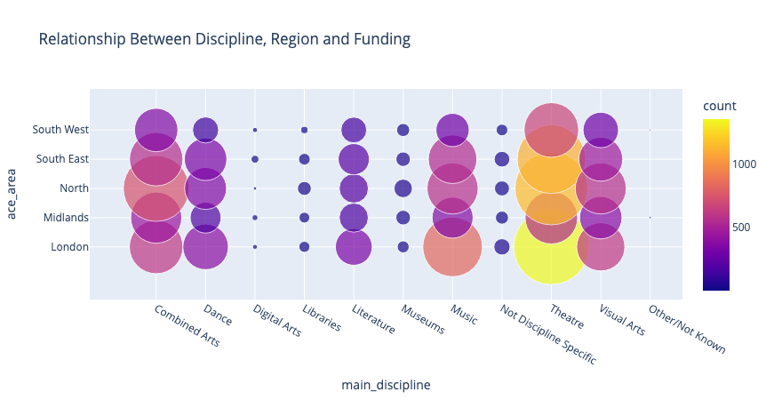
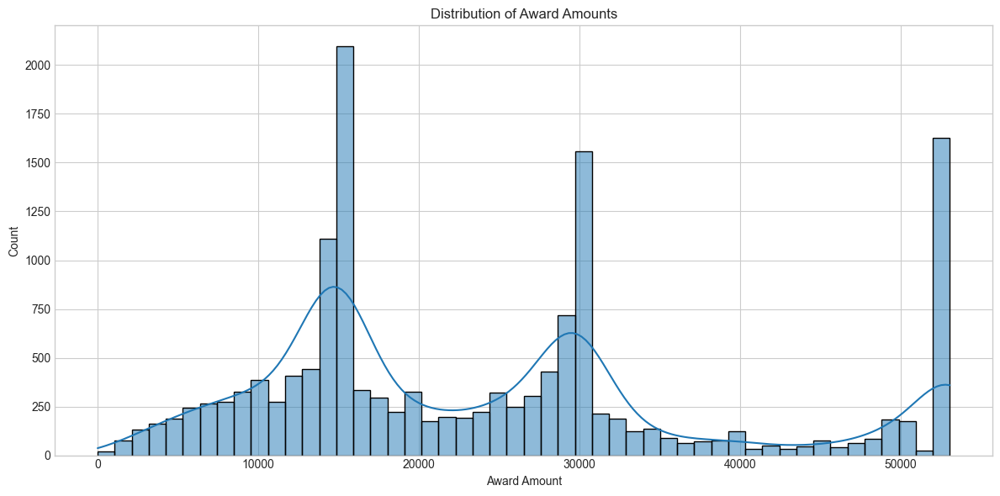
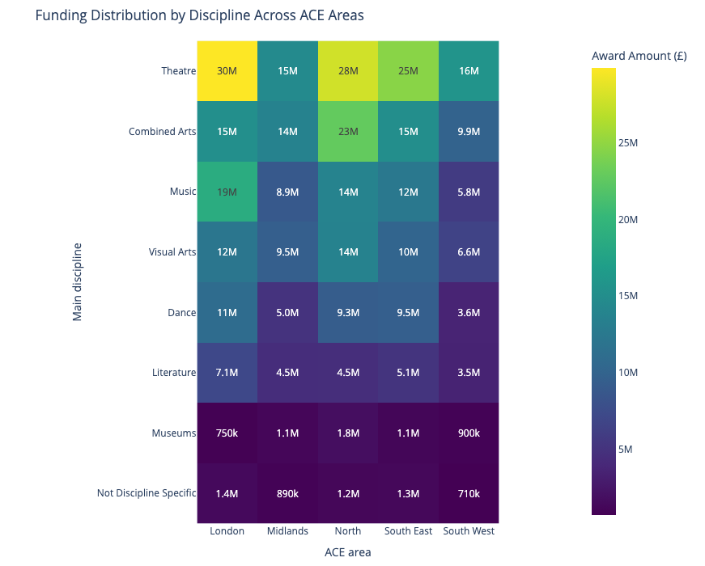
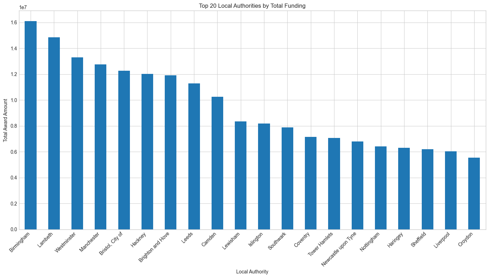

# Arts England Grants Awarded Analysis

>The arts are the soul of any culture, millenia after, art objects are what identify ancient Egyptians, Greeks, Assyrians, Romans, etc. For our present world, we rely on the arts to entertain us and keep us happy and informed.
>Apart from the intangible benefits of the arts, they are a vital part of our economy and a thriving arts scene can be an indicator of a healthy economy.

## Project Brief

This project aims to determine the factors that can help artists and creative communities secure grants from the Arts Council in England. To keep culture and economy alive.

## Dataset Overview and Structure

The data comes from the Arts Council's website [https://www.artscouncil.org.uk/ProjectGrants/project-grants-data]. I chose to use data over five years to establish significant trends. The data is good quality and follows guidelines from the Freedom of Information act. (Show a sample table) It contains data dimensions such as recipient, award amount, activity name, award date, main discipline, and arts area council.

I believe this key dimensions will allow to understand who receive what grant amount, when, and where. All important to determine how grants are awarded from a factual standpoint.

## Challenges

The data was voluminous over 15,000 records, with limited processing power, I had to figure out how to wrangle it. However, the dataset was not too challenging. There were not too many issues, the five years were in individual but consistently formatted excel sheets.

## Data Cleaning Process and Transformation

I choose to use Python and the Pandas library to clean the data, while Microsoft Excel and Power BI are excellent tools, I don't have the compute power to use them and process the number of records efficiently. Python within a Jupyter notebook provides good structure for labelling, coding, and output.

I read the five csv files and concatenated them into one, merging five years into one. This was essential for getting a total count and establishing trends over five years.

* Type was inspected and numeric records (Awards amount) was converted.
* Only one (1) duplicate was found and removed.
* Fields with missing values were also removed.
* A total of 15,467 valid records were found after cleaning.
* Text values were standardised. Eg. Visual' to 'Visual Arts' in main_discipline field.

Finally, I created an empty column to index the records for when I ingest the data to database for future recall of this project.

## Exploratory Data Analysis

1. What disciplines are being funded?
Number of Awards by discipline

2. What areas are being funded the most?
Total funding by ACE area

3. Timing
Funding trend over 5 years

4. Multidimensional analysis

## Visual Analysis & Insights

### Funding distribution across disiplines

Finding the distribution of grant awards across disciplines helps us determine what types of creatives are supported.  

### Funding distribution by disiplines across ACE area

### Top 20 ACE areas for funding.

## Scenarios

If you are in theatre and want the highest chance of funding, the best place to be would be in the North, but other places in the South West, South East, and the Midlands might pose an even stronger chance. Competition is highly in London, especially with a larger population of about 8 million.

Although London and the North receive the most funding, it might be wise to be in other areas like the South West and the Midlands because funding will be prioritised for these under-performing areas.
Combined arts projects or multi-disciplinary projects might be a huge area to explore, especially if they use under funded areas like libraries, literature, and museums.

### Recommendations

1. Find out why awards have dropped over a 5 year period, bceause the arts can revitalise any economy.
2. Why are libraries, literature, and museums receiving a lot less?
    1. Books are the bedrock for the arts as it inspires other art forms.
3. Conduct feasibility studies to determine what regions competitive advantage in terms of arts' disciplines.
    1. Then encourage the regions to boost their economy using these disciplines.
